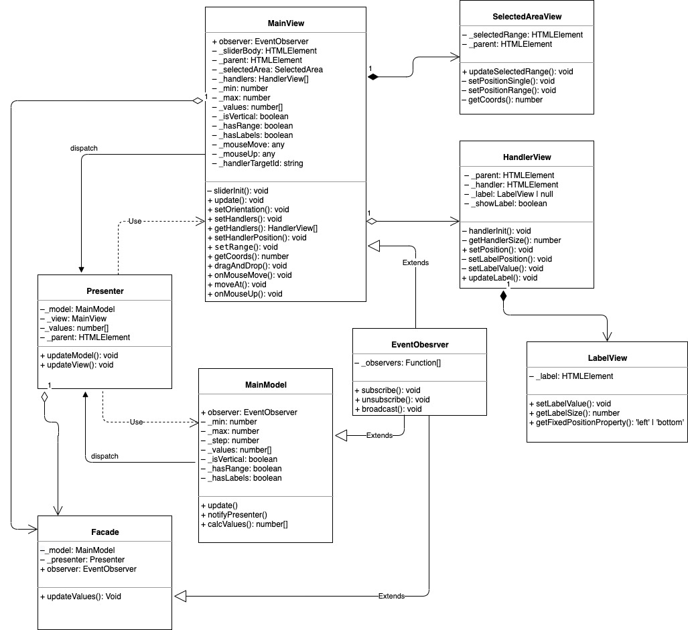

# Range slider

A jQuery plugin to add customizable range slider

Demo page: <a href='https://xenialugovaya.github.io/range_slider/dist/index.html'>see demo page</a>

Report on tests coverage: <a href='https://xenialugovaya.github.io/range_slider/dist/coverage/index.html'>see report</a>

<h2>Build project</h2>
<pre>
<code>$ npm run build</code>
</pre>

<h2>Run tests</h2>
<pre>
<code>$ npm run test</code>
</pre>

<h2>Initialize slider</h2>
<pre>
<code>&lt;div class='slider'&gt;&lt;/div&gt;</code>
</pre>

with default options

<pre>
<code>$('.slider').slider();</code>
</pre>

with custom options

<pre>
<code>$('.slider').slider({
    min: 0,
    max: 100,
    values: [10, 20],
    hasRange: true,
});</code>
</pre>

<h2>Options table</h2>
<table>
<thead>
<tr>
<th>Option</th>
<th>Type</th>
<th>Default value</th>
<th>Description</th>
</tr>
</thead>
<tbody>
<tr>
<td>min</td>
<td>number</td>
<td>0</td>
<td>The minimum limit of the slider</td>
</tr>
<tr>
<td>max</td>
<td>number</td>
<td>100</td>
<td>The maximum limit of the slider</td>
</tr>
<tr>
<td>step</td>
<td>number</td>
<td>1</td>
<td>The step defines how fast handlers move</td>
</tr>
<tr>
<td>values</td>
<td>number[]</td>
<td>[10, 20]</td>
<td>Values define initial position of handlers on the slider. Only numbers in array can be passed, slider can have maximum 2 handlers.</td>
</tr>
<tr>
<td>isVertical</td>
<td>boolean</td>
<td>false</td>
<td>Defines the orientation of slider (horizontal or vertical)</td>
</tr>
<tr>
<td>hasRange</td>
<td>boolean</td>
<td>true</td>
<td>Defines if the slider should have range</td>
</tr>
<tr>
<td>hasLabels</td>
<td>boolean</td>
<td>true</td>
<td>Show or hide labels with current values near handlers</td>
</tr>
</tbody>
</table>

<h2>UML Diagram</h2>

